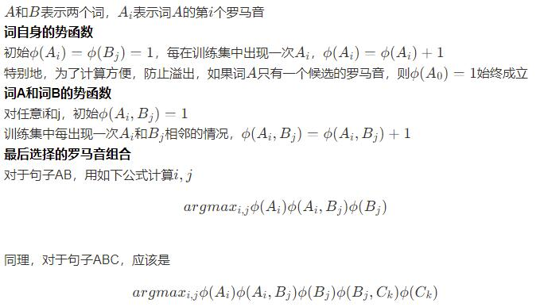

# mrf-japanese-romaji-translator

利用MRF给日语句子注音的工具

## 1.安装
### 1.1 文件介绍
- [mrf.py](./mrf.py) mrf 注音算法主要部分，程序入口
- [separate.py](./separate.py) 分词算法
- [special_chars.py](./special_chars.py) 特殊字符词典
- [dictionary.txt](./dictionary.txt) 日语单词-罗马音词典
- [self_phi.txt](./self_phi.txt) 自身势函数参数文件
- [pair_phi.txt](./pair_phi.txt) 相邻单词势函数文件
### 1.2 安装MeCab
从[官网](https://drive.google.com/uc?export=download&id=0B4y35FiV1wh7WElGUGt6ejlpVXc)下载windows安装文件，安装过程中编码选择utf-8
安装后将MeCab\sdk下的libmecab.lib、MeCab\bin下的文件libmecab.dll复制到python的site-packages目录里面，路径类似这样，需要自己找一下
```
C:\Users\xxx\AppData\Local\Programs\Python\Python36\Lib\site-packages
```
安装python3依赖
```
pip3 install mecab-python-windows
```
## 2.使用
```
python3 mrf.py
```
效果如下


你可以在代码里替换成任何你想要尝试注音的日语句子

## 3.原理
### 3.1 分词
MeCab+最长前缀匹配（前向贪婪跑匹配）
### 3.2 利用mrf建模

### 3.3 特殊字符的处理
综合特殊字符表+词典来判断一个字符是不是特殊字符，按照特殊字符把句子分成合法的部分和不合法的部分，合法的部分注音，不合法的直接复制

## 4.联系方式
欢迎任何对日语注音感兴趣的人加我QQ:806675223
